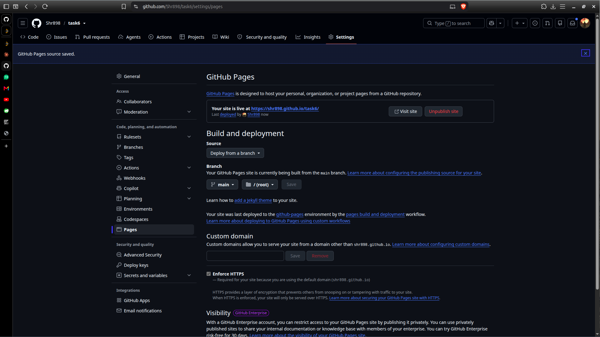
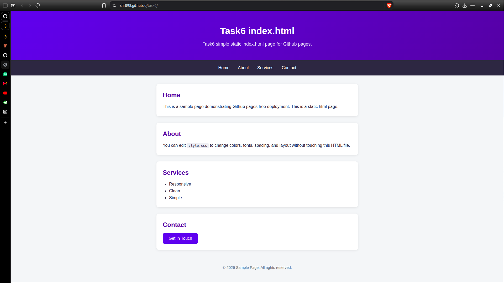
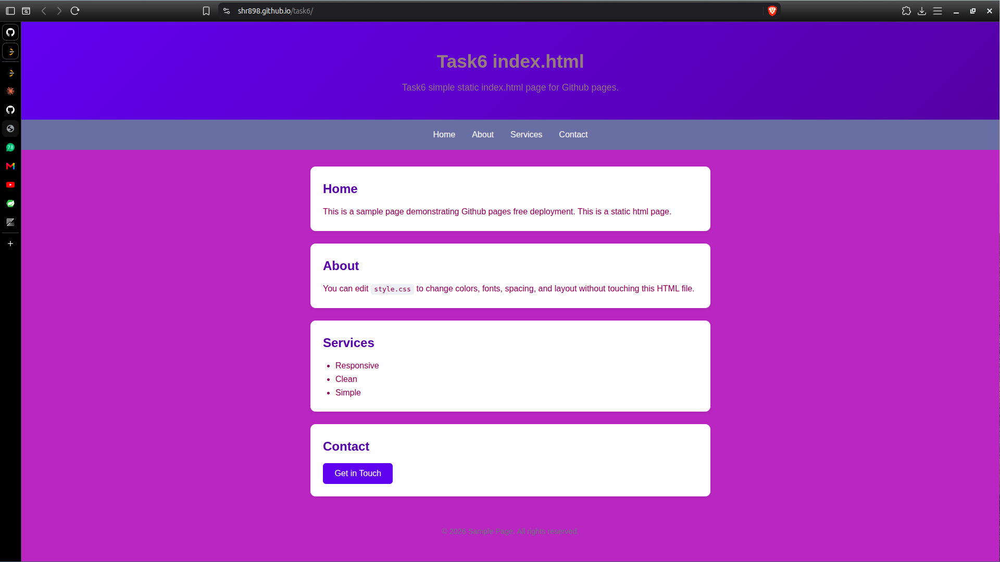

## Task6 Github Pages demonstration.
This is a very simple Github pages demonstration where we host a static html page.
Created a simple index.html file and add some css styling in it.
Then hosted this page on Github pages. 
After hosting it on there, I've changed the css style soo that the effect can be made visible on the Github page.

## Screenshots
## 1. The Github page site has gone live. With the branch set to main and also set to root folder.

## 2. Static page hosted result.

## 3. Static pages css changed result.
